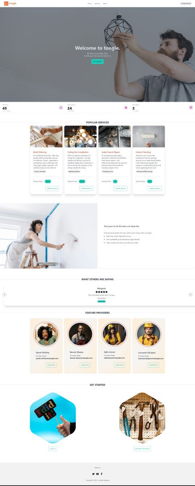
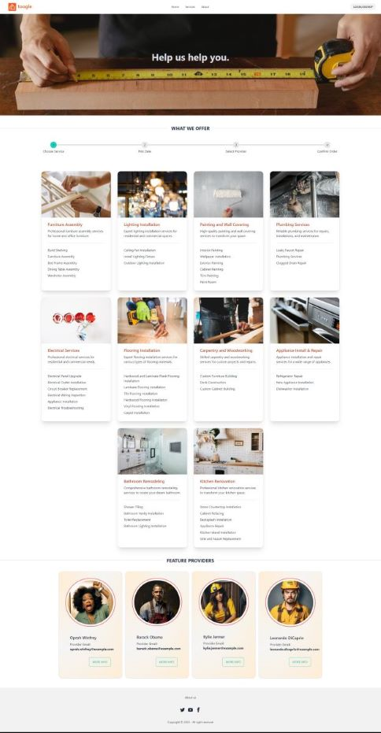

#  <span style="color: #cc451b;">toogle</span>

# License [](https://opensource.org/licenses/MIT)
This project is licensed under the MIT License.
 
toogle is an online platform that connects users with service providers for various services. 

# Description
toogle allows users to browse different categories of services, view service details, and make service bookings. Service providers can showcase their services, manage their availability, and interact with users.

toogle is an online platform that serves as a convenient and efficient medium for connecting users with a wide range of service providers. The platform offers an extensive selection of services across various categories, providing users with the ability to explore and access the services they need.

With toogle, users can effortlessly navigate through different categories of services, gaining insights into each service's specifics and related details. This allows users to make informed decisions based on their preferences, requirements, and budget.

Moreover, toogle simplifies the process of booking services by providing a seamless booking system. Users can select their desired service, choose suitable time slots, and confirm their bookings with just a few clicks. This streamlines the entire booking experience and eliminates the need for extensive communication or back-and-forth interactions.

On the other hand, service providers benefit from toogle by gaining exposure and visibility to a broader user base. They can showcase their services, highlight their expertise, and attract potential customers within their target market. Additionally, toogle equips service providers with tools to manage their availability, ensuring a well-organized schedule that aligns with their business requirements.

Furthermore, toogle fosters interaction and engagement between users and service providers. It enables communication channels for users to ask questions, seek clarifications, or discuss specific details with the service providers directly. This facilitates seamless collaboration and enhances the overall user experience.

In summary, toogle is an all-encompassing online platform that connects users and service providers, offering a user-friendly interface to explore, book, and manage services. Its comprehensive features empower both users and service providers, providing a reliable and efficient solution for accessing and providing various services

# Table of Contents
- [ toogle](#-toogle)
- [License ](#license-)
- [Description](#description)
- [Table of Contents](#table-of-contents)
- [Installation](#installation)
- [Credits](#credits)
- [Technologies Used:](#technologies-used)
    - [Frontend](#frontend)
    - [Backend](#backend)
- [toogle on Heroku:](#toogle-on-heroku)
- [Site Features and Capabilities](#site-features-and-capabilities)
- [Screen Prints:](#screen-prints)
  - [Creating an Order](#creating-an-order)
  - [Account Navigation](#account-navigation)
  - [About Us](#about-us)

# Installation
 To run this project on your local pc, follow the following terminal commands.
```bash
git clone https://github.com/arlindo2017/toogle.gi
cd toogle
npm i
npm run seed
npm run develop
```

# Credits

| Name             | GitHub                                               |
|------------------|------------------------------------------------------|
| Amy Metheny      | [](https://github.com/abmetheny) |
| Arlindo Pinto    | [](https://github.com/arlindo2017) |
| Mirek Nyzio      | [](https://github.com/mnyzio) |
| Parankush Somraj | [](https://github.com/bootcamparankush) |
| Tzvi Neiman      | [](https://github.com/tneiman19) |


# Technologies Used:

### Frontend
- react
- react-datepicker
- tailwind-css
- daisyui
- jwt-decode

### Backend
- MongoDB
- Apollo-server
- Bcrypt
- Graphql
- Jsonwebtoken
- Mongoose
- nodemon

# toogle on Heroku:
[toogle.herokuapp.com](https://toogle.herokuapp.com/)

# Site Features and Capabilities
- Responsive design and interactive elements
- Consistent branding, color scheme, and components throughout the UI
- Options to sign up and log in
  - Upon first visiting the site, you can only browse the main navigation tabs
  - After signing up/in, you have access to account settings, previous orders, and logout options
  - Validation checks ensure required fields are filled out and that the user's email has not previously been registered
- Account Setting page:
  - Displays user information from the database
  - Sub-menu allows users to update their password, view their order history, and delete their account
    - Validation checks require that new passwords be entered twice and that they match, confirm when updates have been successful/unsuccessful, and ask the user to confirm before the account is deleted
  - For users that are registered providers, the "my services" tab is populated with a list of services they provide and an option to remove services from that list
    - Validation checks require the user to confirm before the service is removed from their list and confirms when updates have been successful/unsuccessful
  - The Previous Orders page pulls all provider, service, and order information for all services previously associated with the user's ID in the database as well as newly created orders, which appear at the top of the list
- The Services page is dynamically updated by querying the current categories and associated services in the database; each service links to its own individual service page
- (Single) Service page:
  - Displays service information from the database
  - Progress bar shows where the use currently is in the ordering process (carried over from the Services page)
  - User can select a date and time to schedule their service
  - User can select a provider from the list, which is dynamically updated by querying the current user IDs listed as providers for that service in the database
  - Upon selecting a provider, a modal confirms the order has been successfully placed and the user can click to see their previous orders
- About page features the site's creators and social links

# Screen Prints:
  



## Creating an Order


## Account Navigation


## About Us
